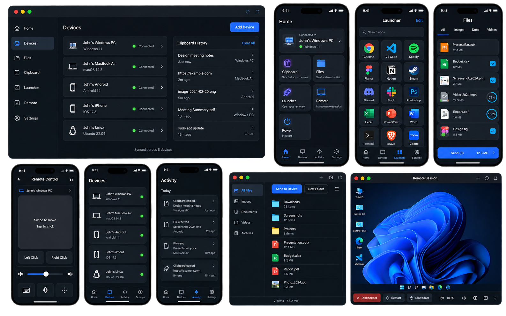
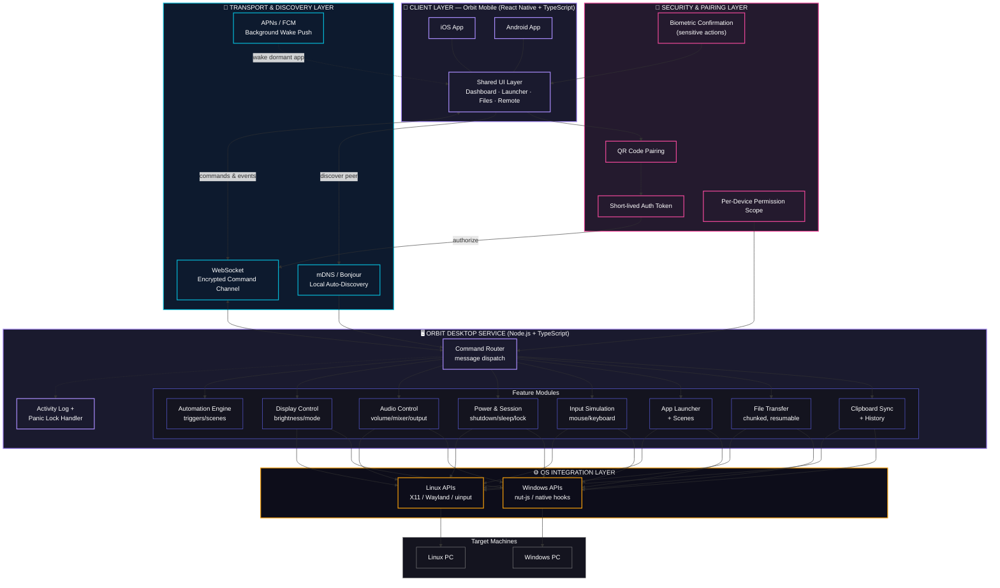

<p align="center">
  <br/>
  <a href="./LICENSE"></a>
  <a href="https://github.com/BiasManan2010/orbit/stargazers"></a>
  <a href="https://github.com/BiasManan2010/orbit/issues"></a>
  <a href="https://buymeachai.in/mananbharti"></a>
  <a href="#"></a>
  <br/>
  <br/>
  
  
  
  
  <br/>
  <br/>
</p>

<p align="center">
  <!-- 🖼️ BOILERPLATE: Orbit logo — replace with design/orbit-logo.svg -->
  
</p>

<h3 align="center">Continuity for every device — not just Apple's</h3>
<p align="center">Clipboard sync · File sharing · Remote control — between your phone and your PC, instantly.</p>

<br/>

<a href="https://github.com/BiasManan2010/orbit">
  <!-- 🖼️ BOILERPLATE: Product screenshot — mobile app + desktop tray, side by side -->
  
</a>

<br/>

> [!NOTE]
> Orbit is in active early development. Features listed below reflect the current build plan — check the [Roadmap](#roadmap) for what's shipped vs. planned.

> [!WARNING]
> ⚠️ Orbit is not a remote-desktop tool. It does not stream your screen or provide screen-sharing/remote-viewing — see [What Orbit Is Not](#what-orbit-is-not).

<br/>

<details>
<summary><b>📑 Table of Contents</b></summary>
<br/>

- [What is Orbit?](#what-is-orbit)
- [Why I Built This](#why-i-built-this)
- [Demo](#demo)
- [Features](#features)
- [Orbit vs. Alternatives](#orbit-vs-alternatives)
- [Supported Platforms](#supported-platforms)
- [Architecture](#architecture)
- [Security & Privacy](#security--privacy)
- [Getting Started](#getting-started)
- [Roadmap](#roadmap)
- [What Orbit Is Not](#what-orbit-is-not)
- [FAQ](#faq)
- [Repository Activity](#repository-activity)
- [Star History](#star-history)
- [Contributing](#contributing)
- [Support the Project](#support-the-project)
- [Built With](#built-with)
- [License](#license)

</details>

<br/>

## What is Orbit?

Apple's Continuity — Handoff, Universal Clipboard, AirDrop — only works between Apple devices. Mix an iPhone with a Windows or Linux PC, or an Android phone with any desktop, and that seamlessness disappears.

**Orbit brings it back, for any combination of devices.** A companion app for your phone and a lightweight service for your PC, connected over a fast local channel, giving you instant clipboard sync, direct file transfer, and full remote control — no cloud round-trips, no vendor lock-in.

<br/>

## Why I Built This

I got tired of emailing files to myself and losing clipboard content every time I switched between my phone and my PC — especially since my devices don't all live in the same ecosystem. Existing tools either lock you into one vendor (Apple Continuity, Samsung Flow) or are limited to one platform pairing (KDE Connect is Android/Linux-only). Orbit is my attempt at building the tool I actually wanted: one that doesn't care what's on either end.

<br/>

## Demo

<!-- 🖼️ BOILERPLATE: Add a hosted demo link or demo GIF once available -->
A live demo will be linked here once Orbit reaches a public beta. In the meantime, see the screenshot above for a preview.

<br/>

## Features

| Feature                                        | Mobile | Desktop |
| :---------------------------------------------- | :----- | :------ |
| Bidirectional clipboard sync                     | Yes    | Yes     |
| Clipboard history across devices                 | Yes    | Yes     |
| Direct file transfer (no cloud)                  | Yes    | Yes     |
| Native share-sheet integration                   | Yes    | N/A     |
| Drag-and-drop file drop zone                      | N/A    | Yes     |
| Auto-organize transferred files                  | N/A    | Yes     |
| Photo auto-backup to PC                          | Yes    | Yes     |
| Customizable app launcher grid                    | Yes    | N/A     |
| Context-aware launcher ("scenes")                | Yes    | N/A     |
| Full mouse/touchpad control                       | Yes    | N/A     |
| Gyroscope mouse mode                             | Yes    | N/A     |
| Full keyboard input + custom macros              | Yes    | N/A     |
| System volume & per-app audio mixer              | Yes    | Yes     |
| Power control (shutdown/sleep/restart/lock)      | Yes    | Yes     |
| Wake-on-LAN                                      | Yes    | N/A     |
| Display brightness & mode control                | Yes    | Yes     |
| Presentation mode (slides + laser pointer)       | Yes    | N/A     |
| Browser tab control                               | Yes    | Yes     |
| QR pairing + biometric confirmation              | Yes    | Yes     |
| Per-device permission scoping                    | N/A    | Yes     |
| Activity log & panic lock                         | Yes    | Yes     |
| Automation / scheduled actions                    | Yes    | Yes     |
| Multi-PC support                                 | Yes    | N/A     |
| Developer/terminal remote access                  | Yes    | Yes     |
| AI-driven natural-language PC control *(planned)* | —      | —       |

<br/>

## Orbit vs. Alternatives

| | Orbit | Apple Continuity | KDE Connect | Remote Mouse |
|---|:---:|:---:|:---:|:---:|
| Cross-ecosystem (any OS combo) | ✅ | ❌ Apple-only | ⚠️ Android/Linux-focused | ✅ |
| Clipboard sync | ✅ | ✅ | ✅ | ❌ |
| Direct file transfer | ✅ | ✅ | ✅ | ❌ |
| App launcher / widget grid | ✅ | ❌ | ⚠️ Limited | ❌ |
| Full mouse/keyboard control | ✅ | ❌ | ⚠️ Limited | ✅ |
| No cloud round-trip | ✅ | ✅ | ✅ | ✅ |
| Screen mirroring | ❌ *(by design)* | ⚠️ Sidecar only | ❌ | ❌ |

<br/>

## Supported Platforms

| | iOS | Android | Windows | Linux |
|---|:---:|:---:|:---:|:---:|
| **Orbit Mobile** | ✅ | ✅ | — | — |
| **Orbit Desktop** | — | — | ✅ | ✅ |

<br/>

## Architecture
 

 
Orbit is made up of two components talking over one encrypted, low-latency channel:
 
- **Orbit Mobile** — React Native app (iOS/Android). Sends commands, receives clipboard/file events.
- **Orbit Desktop** — Node.js background service (Windows/Linux). Simulates input, handles file transfer, executes commands.
Discovery is handled via mDNS/Bonjour on the local network, with QR-code pairing for first connection and a push-notification channel (APNs/FCM) to wake the mobile connection for background events.
 
<br/>
## Security & Privacy

- **Local-first by design** — v1 operates entirely over your local network. No file, clipboard, or command data is routed through a third-party cloud server.
- **Encrypted channel** — all communication between mobile and desktop is encrypted end-to-end; no cleartext transfer of clipboard content or files.
- **No persistent data collection** — Orbit does not log, store, or transmit your file contents or clipboard history to any external service.
- **Explicit pairing required** — every connection starts with a QR code + short-lived token; no device connects without you approving it first.
- **Per-device permissions** *(v2)* — scope what each paired device can do (e.g., mouse/keyboard only, no file access).
- **Panic lock** *(v2)* — instantly lock your PC and revoke all paired-device sessions with one tap.

Found a security issue? Please open a private report rather than a public issue — details will be added here once a disclosure process is set up.

<br/>

## Getting Started

```bash
# Clone the repo
git clone https://github.com/BiasManan2010/orbit.git
cd orbit

# Desktop service
cd desktop && npm install && npm start

# Mobile app
cd ../mobile && npm install && npm run start
```

Full installation and pairing instructions will be published as the project stabilizes.

<br/>

## Roadmap

- [x] Core architecture design
- [ ] **v1** — Clipboard sync, file sharing, app launcher, mouse/keyboard control, power control, QR pairing
- [ ] **v2** — Clipboard history, continuity ("continue on PC"), context-aware launcher, security hardening, presentation mode
- [ ] **v3** — Automation, multi-device support, developer tools, accessibility modes
- [ ] **Future** — AI agent layer for natural-language PC control

<br/>

## What Orbit Is Not

Orbit deliberately does **not** include screen mirroring or remote-desktop viewing (no AnyDesk/TeamViewer-style video streaming). It's built for fast command-and-transfer actions, not remote screen access.

<br/>

## FAQ

<details>
<summary><b>Does Orbit work over the internet, or only on the same WiFi network?</b></summary>
<br/>
v1 is LAN-only — both devices need to be on the same local network. Internet-based control (from outside your network) is a planned future addition, not yet scoped to a version.
</details>

<details>
<summary><b>Is my data encrypted?</b></summary>
<br/>
Yes. All communication between your phone and PC is encrypted end-to-end. See <a href="#security--privacy">Security & Privacy</a> for details.
</details>

<details>
<summary><b>Why not just use KDE Connect or Snapdrop?</b></summary>
<br/>
KDE Connect is excellent but focused on Android + Linux. Snapdrop is great for one-off file drops but doesn't do clipboard sync, remote input, or app launching. Orbit aims to cover the full picture — any mobile OS, any desktop OS, one app.
</details>

<details>
<summary><b>Will Orbit ever support screen mirroring?</b></summary>
<br/>
Not currently planned. Orbit is intentionally scoped away from remote-desktop/screen-streaming — see <a href="#what-orbit-is-not">What Orbit Is Not</a>.
</details>

<details>
<summary><b>Can I control multiple PCs from one phone?</b></summary>
<br/>
This is planned for v3 — switchable per-PC profiles from a single mobile app.
</details>

<br/>

## Repository Activity

<!-- Auto-generates once the repo has commit history -->


<br/>

## Star History

<a href="https://star-history.com/#BiasManan2010/orbit&Date">
  
</a>

<br/>

## Contributing

Orbit is early-stage. Issues, feature ideas, and pull requests are welcome — open an issue to discuss before submitting larger changes. See [CONTRIBUTING.md](./CONTRIBUTING.md) for guidelines, and check [`.github/ISSUE_TEMPLATE`](./.github/ISSUE_TEMPLATE) when filing a bug report or feature request.

<sub>Contributor graph will appear here once the project has more than one contributor.</sub>

<br/>

## Support the Project

If Orbit saved you a few "email it to myself" moments, consider fueling the next build:

<p align="left">
  <a href="https://buymeachai.in/mananbharti"></a>
</p>

<br/>

## Built With

- [React Native](https://reactnative.dev/) — cross-platform mobile app (iOS/Android)
- [Node.js](https://nodejs.org/) — desktop background service (Windows/Linux)
- [nut-js](https://nutjs.dev/) — cross-platform input simulation
- [TypeScript](https://www.typescriptlang.org/) — type safety across mobile and desktop code
- WebSocket + mDNS/Bonjour — local discovery and low-latency transport

<br/>

## License

Orbit is licensed under the [Apache License 2.0](./LICENSE).

<br/>

<p align="center">
  <sub>Built by <a href="https://github.com/BiasManan2010">Manan Bharti</a></sub>
</p>
